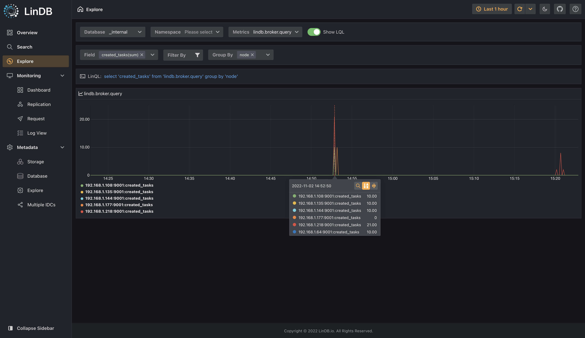

<p align="left">
    
</p>

[](https://github.com/lindb/lindb/blob/main/LICENSE)
[](https://golang.org/)
[](https://goreportcard.com/report/github.com/lindb/lindb)
[](https://github.com/lindb/lindb/actions?query=workflow%3A%22LinDB+CI%22)
[](https://github.com/lindb/lindb/actions?query=workflow%3A%22Forntend+CI%22)
[](https://github.com/lindb/lindb/actions?query=workflow%3A%22Docker+Latest%22)
[](https://github.com/lindb/lindb/actions?query=workflow%3A%22Docker+Release%22)
[](https://github.com/lindb/lindb/actions?query=workflow%3A%22Release%22)
[](https://codecov.io/gh/lindb/lindb)
[](https://godoc.org/github.com/lindb/lindb)
[](CONTRIBUTING.md)
[](https://twitter.com/intent/follow?screen_name=lindb_io)

English | [简体中文](./README-zh_CN.md)

## What is LinDB?

LinDB is an open-source Time Series Database which provides high performance, high availability and horizontal scalability. 

- [Key features](https://lindb.io/guide/introduction.html#key-features)
- [Guide](https://lindb.io/guide/introduction.html)
- [Quick start](https://lindb.io/guide/get-started.html)
- [Design](https://lindb.io/design/architecture.html)
- [Architecture](#architecture)
- [Admin UI](#admin-ui)

## Build

### Prerequisites

To build LinDB from source you require the following on your system.

- [Go >=1.19](https://golang.org/doc/install)
- [Make tool](https://www.gnu.org/software/make/)
- [Yarn](https://classic.yarnpkg.com/en/docs/install)

### Get the code

```
git clone https://github.com/lindb/lindb.git
cd lindb
```

### Build from source

To build only LinDB core.(without web console)

```
make build
```

To build both LinDB core and frontend.

```
make build-all
```

### Test

```
make test
```

### Access web interface(for developer)

Start the node.js app to view LinDB web interface in dev mode.

```
cd web
yarn install 
yarn dev
```

You can access the LinDB web interface on your [localhost port 3000](http://localhost:3000/)

## Architecture


## Admin UI

Some admin ui snapshots.

### Overview


### Monitoring Dashboard


### Replication State


### Data Explore



### Explain


## Contributing

Contributions are welcomed and greatly appreciated. See [CONTRIBUTING](CONTRIBUTING.md) for details on submitting patches and the contribution workflow.

#### CI 
Pull requests should be appropriately labeled, and linked to any relevant [bug or feature tracking issues](https://github.com/lindb/lindb/issues). 
All pull requests will run through GITHUB-Actions. Community contributors should be able to see the outcome of this process by looking at the checks on their PR and fix the build errors.

#### Static Analysis 
This project uses the following linters. Failure during the running of any of these tools results in a failed build. Generally, code must be adjusted to satisfy these tools.

- [gofmt](https://golang.org/cmd/gofmt/) - Gofmt checks whether code was gofmt-ed. By default this tool runs with -s option to check for code simplification;
- [golint](https://github.com/golang/lint) - Golint differs from gofmt. Gofmt reformats Go source code, whereas golint prints out style mistakes;
- [goimports](https://godoc.org/golang.org/x/tools/cmd/goimports) - Goimports does everything that gofmt does. Additionally it checks unused imports;
- [errcheck](https://github.com/kisielk/errcheck) - Errcheck is a program for checking for unchecked errors in go programs. These unchecked errors can be critical bugs in some cases;
- [gocyclo](https://github.com/alecthomas/gocyclo) - Computes and checks the cyclomatic complexity of functions;
- [maligned](https://github.com/mdempsky/maligned) - Tool to detect Go structs that would take less memory if their fields were sorted;
- [dupl](https://github.com/mibk/dupl) - Tool for code clone detection;
- [goconst](https://github.com/jgautheron/goconst) - Finds repeated strings that could be replaced by a constant;
- [gocritic](https://github.com/go-critic/go-critic) - The most opinionated Go source code linter;

## License

LinDB is under the Apache 2.0 license. See the [LICENSE](LICENSE) file for details.
